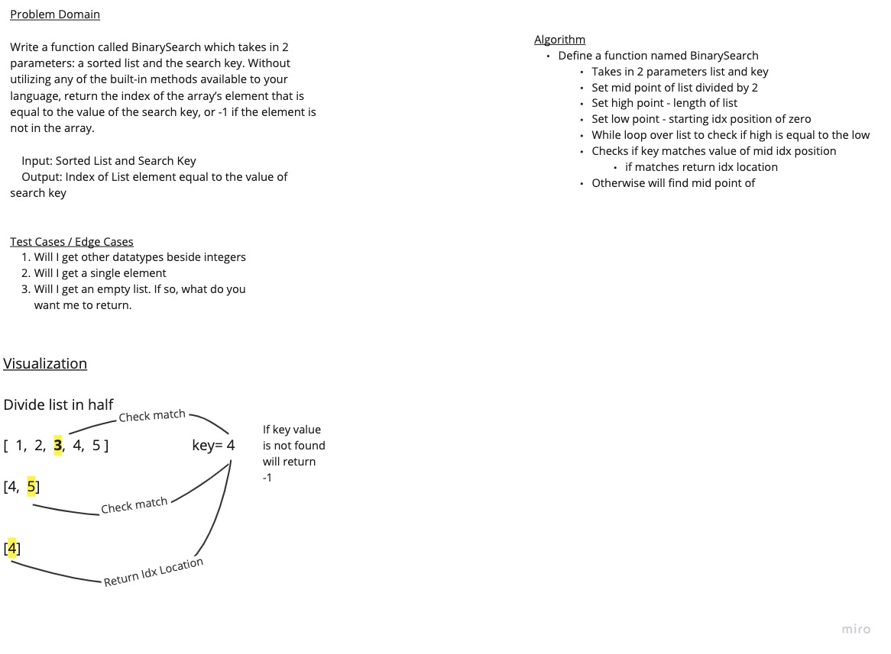

# Binary search in a sorted 1D array

Write a function called BinarySearch which takes in 2 parameters: a sorted array(list) and the search key. Without utilizing any of the built-in methods available to your language, return the index of the array’s(list) element that is equal to the value of the search key, or -1 if the element is not in the array.

## Whiteboard Process

## Approach & Efficiency

The approach taken for this Code Challenge was to divide the list in half and compare the middle idx value to the key value, if matched return the idx position, if not, move to the higher value next to the mid-point and compare again. Continue until the key search is matched. If not match found return -1. Set a high point (length of the list) and a low point (starting idx at position zero) while loop over list to check if high is equal to low to find mid-point. Returns idx position.
___

___

**Contributors:**
* Brendon
* Jacob
