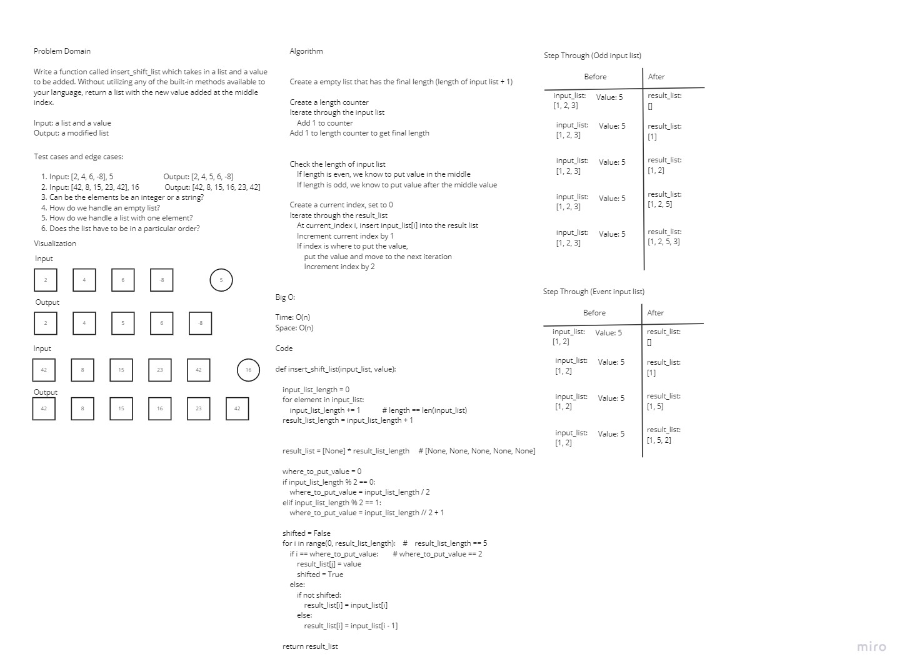

# Insert and shift an array in middle at index

Write a function called insertShiftArray (insert_shift_list in Python) which takes in an array (list) and a value to be added. Without utilizing any of the built-in methods available to your language, return an array (list) with the new value added at the middle index.

## Whiteboard Process

## Approach & Efficiency

The approach taken for this Code Challenge was to first iterate over the input_list to determine its length and add 1 to it to get a final length. Check with conditional expressions if the length of list items is even or odd. Iterate over our results_list to check where to put the new value depending on index position. Return the results_list.

**BigO**
* Time - O(n)
* Space - O(n)
___

**Contributors:**
* Andy Nguyen
* Natalija Germek

