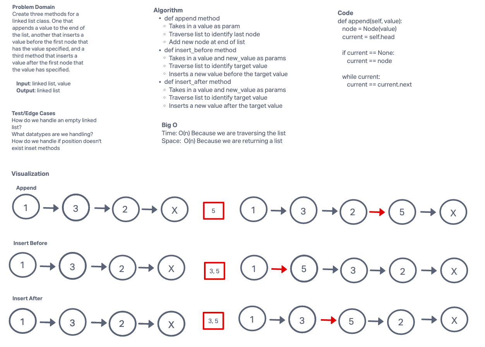

# Linked List Insertions

Write the following methods for the Linked List class:

**append**
* arguments: new value
* adds a new node with the given value to the end of the list

**insert before**
* arguments: value, new value
* adds a new node with the given new value immediately before the first node that has the value specified

**insert after**
* arguments: value, new value
* adds a new node with the given new value immediately after the first node that has the value specified

## Whiteboard Process

## Approach & Efficiency

**BigO**
* Time - O(n) because we are traversing the list
* Space - O(n) because we are returning the list

## Solution

[Code](/Users/Alex/projects/data-structures-and-algorithms/python/data_structures/linked_list/linked_list.py)
___

### Contributors
* Daniel Brott
* Natalija Germek

