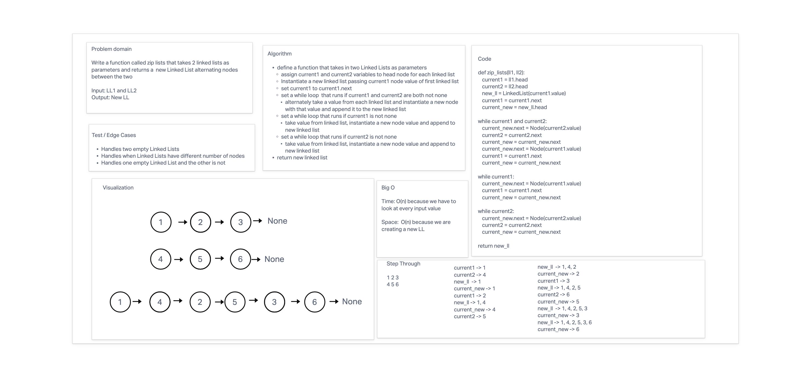

# Zip Two Linked Lists

Write a function called zip_lists
* Arguments: 2 linked lists
* Zip the two linked lists together into one so that the nodes alternate between the two lists.
* Return: New zipped linked list
* Try and keep additional space down to O(1)

## Whiteboard Process

## Approach & Efficiency

**BigO**
* Time - O(n) because we have to look at every input value
* Space - O(n) because we are creating a new linked list

## Solution

* [code](/Users/Alex/projects/data-structures-and-algorithms/python/code_challenges/linked_list_zip/linked_list_zip.py)

## Contributor

  * Monika Davies
