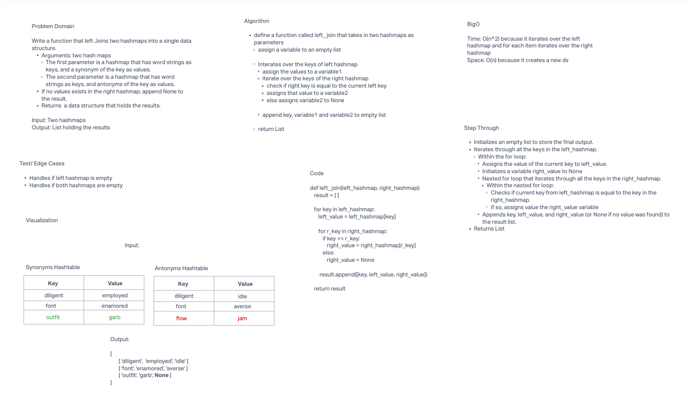

# Implement a simplified LEFT JOIN for 2 Hashmaps.

* Write a function called left_join that joins two hashmaps into a single data structure.
  * Arguments: two hashmaps
    * The first parameter is a hashmap that has word strings as keys, and a synonym of the key as values.
    * The second parameter is a hashmap that has word strings as keys, and antonyms of the key as values.
  * Returns a data structure that holds the results.
* Combines the key and corresponding values into a new data structure (List) according to LEFT JOIN logic.
* LEFT JOIN means all the values in the left hashmap are returned, and if values exist in the right hashmap, they are appended to the result row. If no values exist in the right hashmap, then None should be appended to the result row.

## Whiteboard Process

## Approach & Efficiency

**BigO**
* Time: O(n^2) because it iterates overt the left hashmap, and for each item iterates over the right hashmap.
* Space: O(n) because it creates a new ds.

## Solution

* [code](/Users/Alex/projects/data-structures-and-algorithms/python/code_challenges/hashtable_left_join.py)
