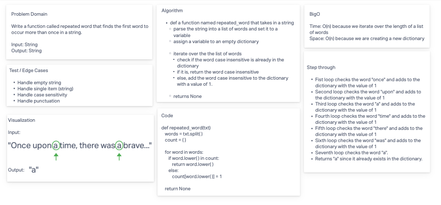

# Find the first repeated word

* Write a function called repeated word that finds the first word to occur more than once in a string
  * Arguments: string
  * Return: string

## Whiteboard Process

## Approach & Efficiency

**BigO**
* Time: O(n) because we iterate over the length of a list of words
* Space: O(n) because we are creating a new dictionary

## Solution

* [code](/Users/Alex/projects/data-structures-and-algorithms/python/code_challenges/hashtable_repeated_word.py)
