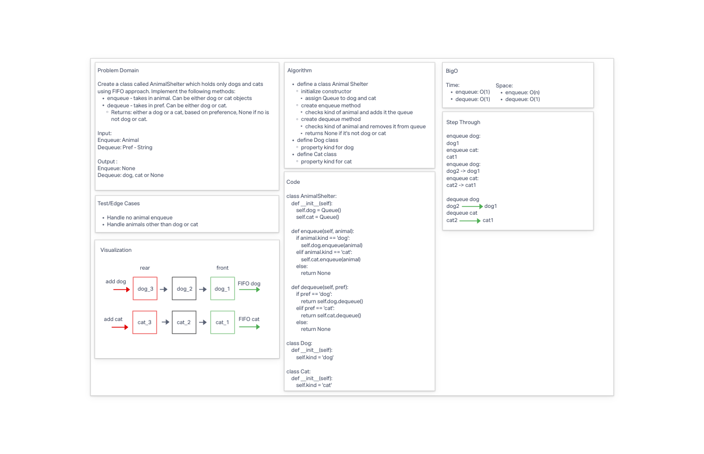

# Animal Shelter

* Create a class called AnimalShelter which holds only dogs and cats. FIFO approach.
* methods:
  * enqueue
    * Arguments: animal
      * animal can be either a dog or a cat object.
  * dequeue
      * Arguments: pref
        * pref can be either "dog" or "cat"
      * Return: either a dog or a cat, based on preference.
        * If pref is not "dog" or "cat" then return null.

## Whiteboard Process

## Approach & Efficiency

**BigO**
* Time:
  * enqueue: O(1)
  * dequeue: O(1)
* Space:
  * enqueue: O(n)
  * dequeue: O(1)

## Solution

* [code](/Users/Alex/projects/data-structures-and-algorithms/python/code_challenges/stack_queue_animal_shelter.py)
