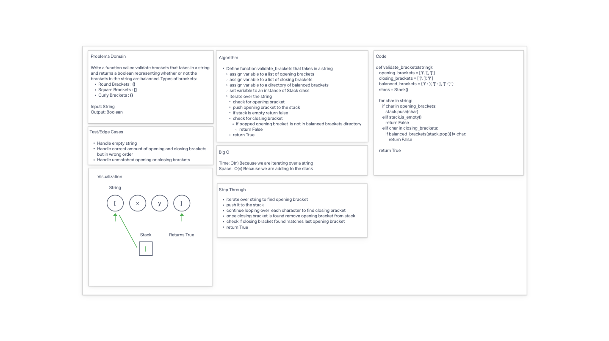

# Multi-bracket Validation

* Write a function called `validate_brackets`
  * Arguments: string
  * Return: boolean representing whether or not the brackets in the string are balanced
* Types of brackets:
  * Round Brackets : ()
  * Square Brackets : []
  * Curly Brackets : {}

## Whiteboard Process

## Approach & Efficiency

**BigO**
* Time: O(n) Because we are iterating over a string.
* Space: O(n) Because we are adding to the stack.

## Solution

* [code](/Users/Alex/projects/data-structures-and-algorithms/python/code_challenges/stack_queue_brackets.py)
