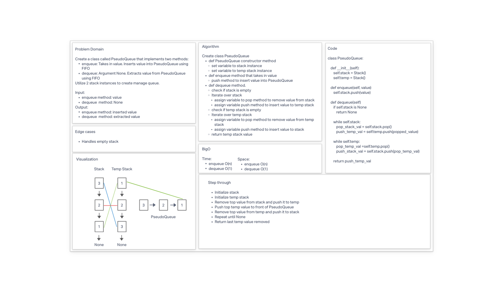

# Implement a Queue using two Stacks

* Create a new class called PseudoQueue
* Methods:
  * enqueue:
    * Arguments: value
    * Inserts a value into the PseudoQueue, using a first-in, first-out approach.
  * dequeue:
    * Arguments: none
    * Extracts a value from the PseudoQueue, using a first-in, first-out approach.
* Internally, utilize 2 Stack instances to create and manage the queue

## Whiteboard Process

## Approach & Efficiency

**BigO**
* Time:
  * enqueue: O(n)
  * dequeue: O(1)
* Space:
  * enqueue: O(n)
  * dequeue: O(1)

## Solution

* [code](/Users/Alex/projects/data-structures-and-algorithms/python/code_challenges/stack_queue_pseudo.py)
