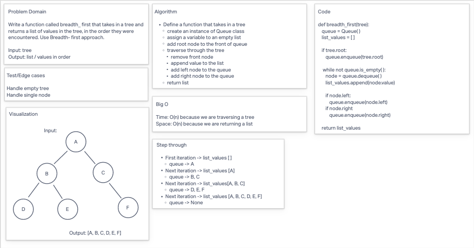

# Breadth-first Traversal

* Write a function called breadth first
  * Arguments: tree
  * Return: list of all values in the tree, in the order they were encountered

## Whiteboard Process

## Approach & Efficiency

**BigO**
* Time: O(n because we are traversing a tree
* Space: O(n) because we are returning a list

## Solution

* [code](/Users/Alex/projects/data-structures-and-algorithms/python/code_challenges/tree_breadth_first.py)
