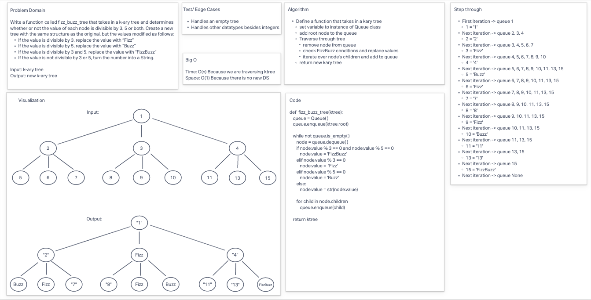

# “FizzBuzz” on a k-ary tree

* Write a function called fizz_buzz_tree
  * Arguments: k-ary tree
  * Return: new k-ary tree
* Determine whether or not the value of each node is divisible by 3, 5 or both. Create a new tree with the same structure as the original, but the values modified as follows:
  * If the value is divisible by 3, replace the value with “Fizz”
  * If the value is divisible by 5, replace the value with “Buzz”
  * If the value is divisible by 3 and 5, replace the value with “FizzBuzz”
  * If the value is not divisible by 3 or 5, simply turn the number into a String.

## Whiteboard Process

## Approach & Efficiency

**BigO**
* Time: O(n) Because we are traversing ktree
* Space: O(1) Because the is no new DS

## Solution

* [code](/Users/Alex/projects/data-structures-and-algorithms/python/code_challenges/tree_fizz_buzz.py)
