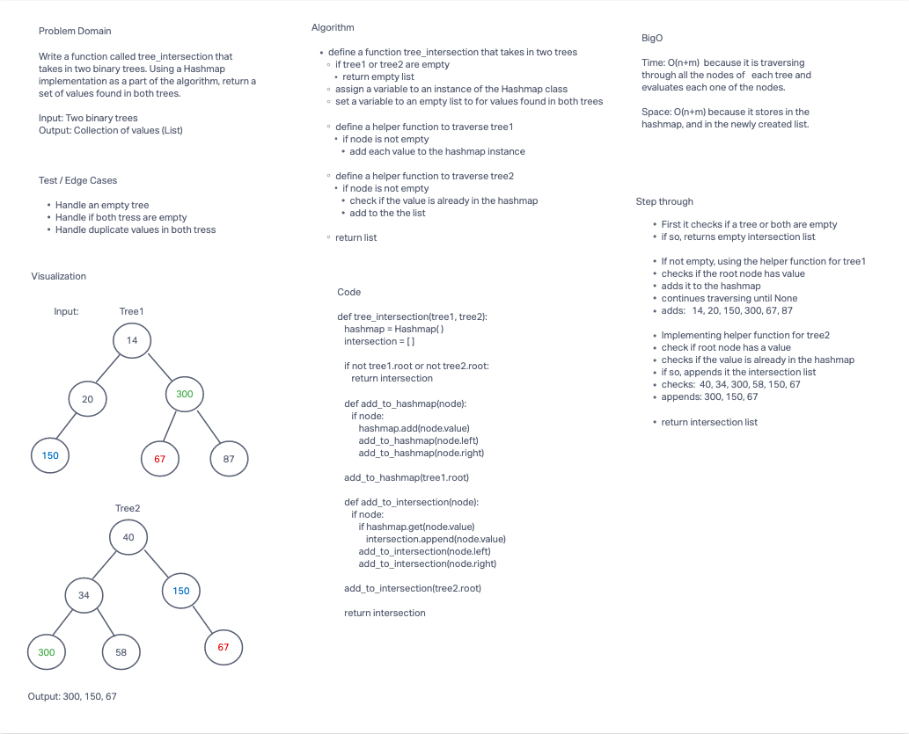

# Find common values in 2 binary trees

* Write a function called tree_intersection that takes two binary trees as parameters.
  * Implementation Hashmap as a part of the algorithm.
  * Return a set of values found in both trees.

## Whiteboard Process

## Approach & Efficiency

**BigO**
* Time: O(n+m) because it is traversing through all the nodes of each tree and evaluates each one of the nodes.
* Space: O(n+m) because it stores in the hashmap, and in the newly created list.

## Solution

* [code](/Users/Alex/projects/data-structures-and-algorithms/python/code_challenges/tree_intersection.py)
