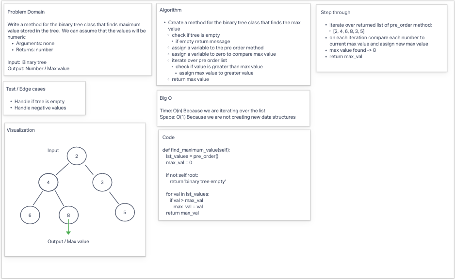

# Find the Maximum Value in a Binary Tree

* Write a method for the Binary Tree class that finds the maximum value stored in the tree. We can assume that the values will be numeric.
  * Arguments: none
  * Returns: number

## Whiteboard Process

## Approach & Efficiency

**BigO**
* Time: O(n) Because we are iterating over the list
* Space: O(1) Because we are not creating new data structures

## Solution

* [code](/Users/Alex/projects/data-structures-and-algorithms/python/data_structures/binary_tree.py)
