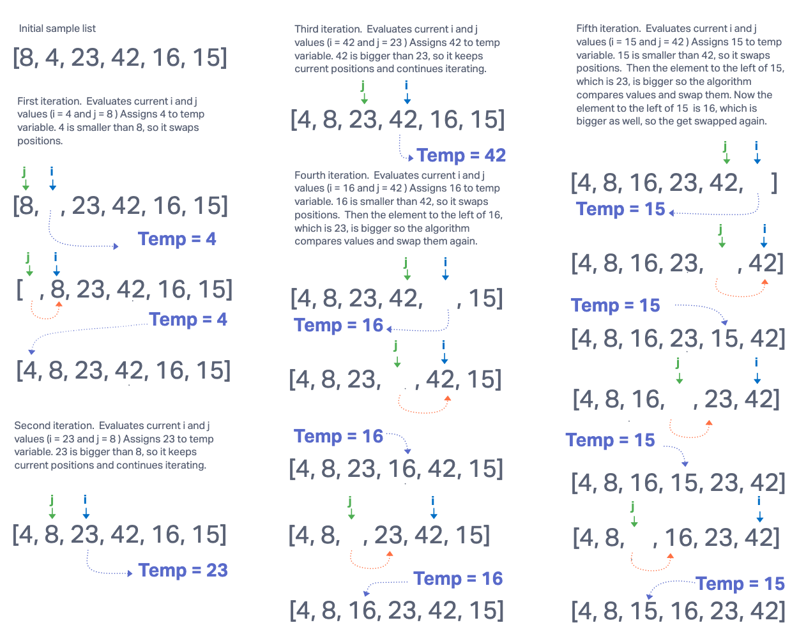

# Insertion Sort Algorithm

---

Insertion sort in python is a sorting algorithm that builds a sorted list by iterating over the elements of the list, and inserting each item into its proper position within list, one element at a time.

### Step Through Explanation

Let's break down the whole process step-by-step using the following input list:

```python
sample_list = [8, 4, 23, 42, 16, 15]
```

#### Code

```python
def insertion_sort(lst):

    for i in range(1, len(lst)):
        j = i - 1
        temp = lst[i]

        while j >= 0 and temp < lst[j]:
            lst[j + 1] = lst[j]
            j = j - 1

        lst[j + 1] = temp

    return lst
```

1. The first thing we have to do is to define a function called `insertion_sort()` that takes in a list as input.
2. Next we use a for loop to iterate over the whole list starting at index 1 implementing the `range()` method. `i` represents the current index position.
3. Now we declare a variable that will be used to keep track of the elements to be compared with the current index. We set `j as i - 1` which points to the element to the left of `i` so we can compare them.
4. Next we set a variable `temp` to store the current value at index `i`, which will be inserted into the correct position in the list.
5. Now we use a while loop to check each value to the left of the current index, one at a time until we find a value smaller than the current `temp` value.
6. Next the current element at index `j` gets shifted to the right one step `j + 1` making room for the current `temp` element to be inserted.
7. Now we update `j` to `j = j - 1` to continue iterating and comparing values.
8. Next the new `temp` value gets inserted into the right position.
9. Once we complete all iterations and the list elements are in order, we `return` the list.

### Step-by-step visualization



### Time and Space complexity

Insertion sort is not the most efficient algorithm for sorting large lists, but it has a relatively low space complexity. It can be useful for sorting small lists or lists that are almost sorted.

* **Time complexity:**
  * O(n^2) The algorithm has to iterate over the whole list for each element in it.

* **Space Complexity:**
  * O(1) The amount of memory used doesn't depend on the size of the input list. It sorts the list in place without creating any additional data structures.
